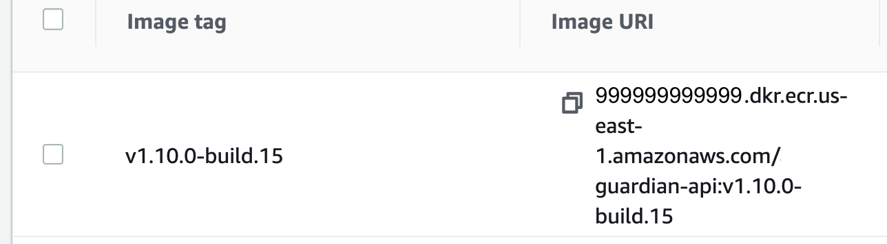
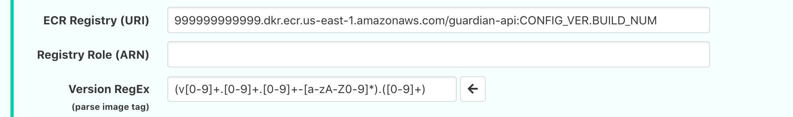
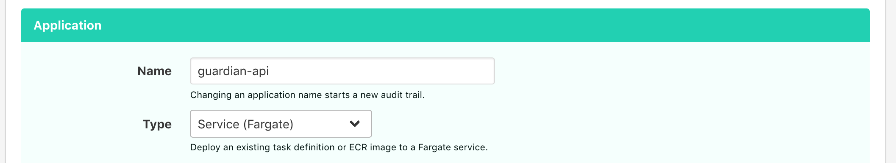
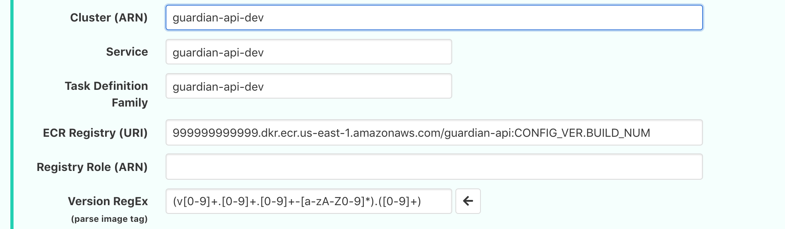
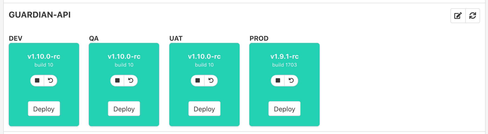

# How to Configure Fargate Tasks

Fargate tasks can usually be configured in the portal without additional changes in AWS.

When listing deployable versions to the user, uDeploy can display image tags found in an existing service's Task Definition Family or ECR (optionally configured). 

A regular expression will be configured in the portal to extract the version and build from the image tag for both the Task Definition Family and ECR sources.

## List Deployable Versions from ECR (optional)

Each ECR image should be tagged with the version **v1.10.0-build** and build **#15** as seen below. ([semver](http://www.semver.com) recommended but not required)

The `ECR Registry` field should be populated if any images only exist in ECR. Any image in an existing Fargate Task Definition will be displayed automatically.

The `Version RegEx` field should contain a regular expression with a capturing group for the version and a second capturing group for the build number. 

## Configuring Tasks in uDeploy

In the portal scroll to the bottom of all the apps, and click the **ADD APPLICATION** option to see the following settings. Admin permissions are required.

The `Name` and `Type` fields should be set accordingly. 
* When the `Scheduled Task (Fargate)` option is chosen, an additional field called `Event Rule` will be required below. It should be populated with the name of the AWS CloudWatch rule that controls the tasks schedule.
* When the `Service (Fargate)`  option is chosen no additional fields are needed since the service runs continuously.

The `Cluster`, `Service`, and `Task Defintion Family` are requred for the portal to find the Fargate task.

The `Version RegEx` field should contain a regular expression with a capturing group for the version and a second capturing group for the build number. 

The `ECR Registry` field is only required when deploying images that are not listed in any existing Task Definition.

When everything is set up correctly, the dashboard will resemble the screenshot below.

* Green indicates a healthy service state. 
* Blue indicates a healthy scheduled task state. 
* Red indicates an error is occuring.
* Gray indicates the task is stopped or disabled.
* Yellow indicates an action/transition is taking place. (deploying, starting, stopping)

Don't forget to provide appropriate deploy permissions to the users.