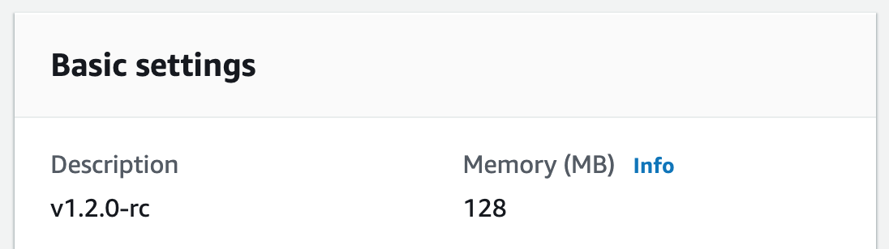

# How to Configure Lambda

Lambda functions require additional preparation by adding a lambda alias and version in AWS to support immutable and user friendly versioned deployments. An S3 bucket for storing compressed lambda deployment artifacts instead of a direct upload is optional but recommended due to limitations on [direct uploads](https://docs.aws.amazon.com/lambda/latest/dg/gettingstarted-limits.html). 


## Preparing the Lambda Function in AWS

Each environment should be a separate lambda function, and each function needs an alias and version. The lambda alias must point to a specific numbered version. Since the default lambda version, `$LATEST` version is mutable, it is ignored by uDeploy. uDeploy only supports immutable versions to avoid overwriting a deployment without changing the version number. 

Additionally, each environment's initial lambda version description field must contain a user friendly version number ([semver](http://www.semver.org) recommended, but not required). Additional descriptive text can exist in the description field. A regex used to parse the version out of the description field will be configured later in uDeploy. 

In this screenshot, the lambda version's description is set to **v1.2.0-rc**.  This description field will be parsed by a regex configured in uDeploy and displayed to the user. A build number, **v1.2.0-rc.123**, can also be a part of the version and will be displayed in the portal. When a build number is not present, a hash generated by AWS lambda will be displayed in the portal.



In this screenshot, the lambda **"dev"** alias is pointing to version **#17**. Each time a new version of the lambda is published the CI/CD process should point the alias to the new version. When uDeploy promotes the lambda to another environment, it will re-point the alias in the new environment to the new version.


<details>
  <summary>Lambda Version Example (Terraform)</summary>

Notice the lambda alias points to a lambda version `"1"`, and not the default `$LATEST`.
```
resource "aws_lambda_alias" "function_alias" {
  name             = "${var.app}-alias-${var.environment}"
  description      = "alias triggered by AWS event"
  function_name    = aws_lambda_function.function.arn
  function_version = "1"
}
```

The resource invoking the lambda must be pointed to the alias `aws_lambda_alias.function_alias.arn` and not directly to the function ``aws_lambda_function.arn`` for deployments to work properly.
```
resource "aws_lambda_event_source_mapping" "lambda_event" {
  batch_size       = 1
  enabled          = true
  event_source_arn = aws_sqs_queue.queue.arn
  function_name    = aws_lambda_alias.function_alias.arn
}
```

</details>


## Choose Artifact Upload Location

<details>
  <summary>Direct Upload (upload code directly to function)</summary>

The CI/CD process will need to...
1. Update the lambda description with a user friendly version in dev.

```bash
$ aws lambda update-function-configuration --function-name ${LAMBDA_FUNCTION} --description ${LAMBDA_DESCRIPTION}
```

2. Publish the new version to dev.

```bash
$ aws lambda update-function-code --function-name ${LAMBDA_FUNCTION} --publish --zip-file ${FILE}
```

3. Point the alias to the newly published version in dev.

```bash
$ aws lambda update-alias --function-name ${LAMBDA_FUNCTION} --function-version ${LAMBDA_VERSION} --name ${LAMBDA_ALIAS}
```

Performing these functions requires the CI/CD to have the following AWS account permissions:

* lambda:UpdateFunctionCode
* lambda:UpdateFunctionConfiguration
* lambda:UpdateAlias

</details>

<details>
  <summary>S3 Bucket (upload code to S3 and reference location)</summary>

The CI/CD process will need to...

1. Upload the compressed file to an S3 bucket using a revision number for the file name and include the following two meta data fields. (artifact registry)

* `x-amz-meta-version`: The user friendly version and build number. This field is parsed by the regular expression configured in uDeploy.
* `x-amz-meta-revision`: The same revision number as the compressed file's name specifying a unique artifact upload.


```bash
$ aws s3 cp artifacts/${REVISION_NUMBER}.zip s3://artifacts/${PROJECT}/${S3_BUCKET}/${REVISION_NUMBER}.zip --metadata revision=${REVISION_NUMBER},version=${VERSION}.${BUILD_NUMBER}
```

2. Update the lambda function code in dev.

NOTE: If secrets exist in the lambda env vars, it may be worth redirecting the output to null by adding ` >> /dev/null` to the command.

```bash
$ aws lambda update-function-code --function-name ${LAMBDA_FUNCTION} --s3-bucket ${S3_BUCKET} --s3-key ${REVISION_NUMBER}.zip
```

3. Publish the new version in dev.

```bash
$ aws lambda publish-version --function-name ${LAMBDA_FUNCTION}
```

4. Point the alias to the newly published version in dev.

```bash
$ aws lambda update-alias --function-name ${LAMBDA_FUNCTION} --function-version ${LAMBDA_VERSION} --name ${LAMBDA_ALIAS}
```

Performing these functions requires CI/CD to have the following AWS account permissions:

* s3:PutObject
* lambda:UpdateFunctionCode
* lambda:UpdateFunctionConfiguration
* lambda:UpdateAlias
* lambda:PublishVersion

</details>


## Configuring Lambda in uDeploy

Once you have the function, alias, and version set up in AWS; it is time to configure uDeploy. In the portal scroll to the bottom of all the apps, and click the **ADD APPLICATION** option to see the following settings. Admin permissions are required.


The `App Name`, `App Type`, `Lambda Function`, `Lambda Alias`, and `Version RegEx` (for parsing the description field) are REQUIRED fields.

IMPORTANT: If the lambda artifacts were uploaded to S3, the `S3 Registry (Bucket)` is also REQUIRED and the `S3 Registry (Prefix)` is optional. If using direct upload, these fields should be skipped.

When everything is set up correctly, the dashboard will resemble the screenshot below.


uDeploy is not currently aware when a lambda function is executing. Blue cards indicate a healthy state. A Red card will be displayed when errors occur in the lambda logs.

Don't forget to provide appropriate deploy permissions to the users.