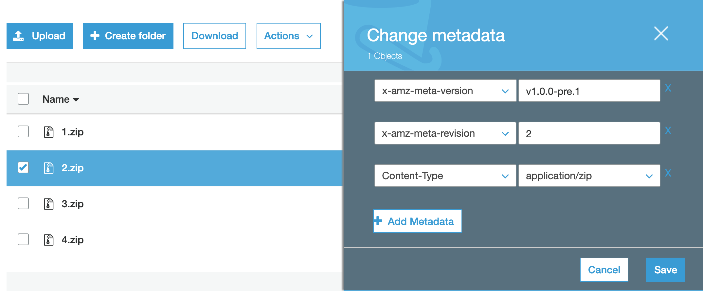
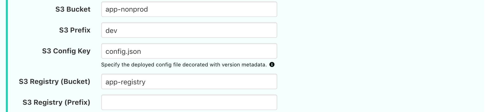
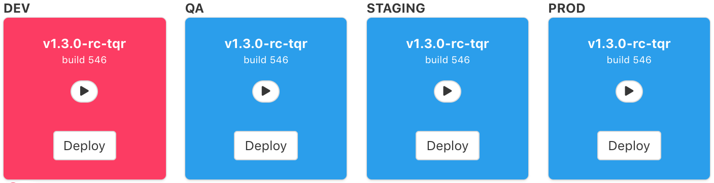

# How to Configure S3 Buckets

S3 deployments allow compressed artifacts in an S3 registry bucket to be uncompressed and copied to other S3 buckets. (e.g. dev, qa, uat, prod) 

## Preparing the S3 Buckets in AWS

### Environments

Each environment can be a separate S3 bucket or a single S3 bucket can contain mulitple environments with each environment is separated by a key prefix. (e.g. `dev/public/index.html`, `qa/public/index.html`, etc.)

Each environment S3 bucket, should wire up an event to notify uDeploy of object changes. An event queue, `udeploy-prod-s3-queue`, is automatically created by the uDeploy infrastructure and should be selectable.

### Artifact Registry

A seprate S3 bucket, called a registry, needs to be created to hold the compressed S3 artifacts for deploying between environments. Details on how to upload artifacts to this bucket are ezplained in future steps.

## Setting Up CI/CD

### DEPLOYMENT STEPS

1. Deploy the files to the **dev** S3 bucket location along with an additional uDeploy file, `config.json`. 

**IMPORTANT:** 
- The `config.json` file should be decorated with two metadata fields, **version** and **revision**, which allow uDeploy to determine the deployed version. Decorating all files with the metadata is fine and has additional benefits. 
- The `config.json` file should contain a key/value json object that may be left empty, `{}`. These values can be used by the application and are displayed/updated during deployments in the portal.
- The `config.json` file can be named anything since it is configurable in uDeploy.

2. Compress the files into a single artifact called `{{REVISION}}.zip`, (e.g. `1.zip`) and upload to an S3 bucket created to be the artifact registry. 

**IMPORTANT:** The artifact should be decorated with two metadata fields, **version** and **revision**, which allow uDeploy to list and deploy version to different environments.

### METADATA DESCRIPTION 

|Field|Value|Decription|
|-|-|-|
|`x-awz-meta-version`|`v1.0.0-app.3`| Version, `v1.0.0-app`, plus build number, `3`.|
|`x-awz-meta-revision`|`1`| Revision number must be numeric and match the corresponding uploaded artifact name. (e.g. `1.zip`) |

**NOTE:** When using the AWS CLI to upload files to S3, the prefix, `x-awz-meta-`, is typically automatically added to user defined metadata.

## Configuring S3 Bucket in uDeploy

Once the S3 buckets are setup, it is time to configure uDeploy. In the portal scroll to the bottom of all the apps, and click the **ADD APPLICATION** option to see the following settings. Admin permissions are required.

Choose "**S3 Bucket**" from the "**Type**" dropdown list.

For each environment, populate the following fields S3 bucket fields.

|Field|Required|Description|
|-|-|-|
|Name|yes|The unique name of the application.|
|S3 Bucket|yes|The bucket hosting the specific environment.|
|S3 Prefix|no|The key prefix the environment files are under if multiple environments are hosted in the same bucket.|
|S3 Config|yes|The name of the config file that uDeploy uses to determine the deployed version.|
|S3 Registry (Bucket)|yes|The name of the S3 bucket where deployable artifacts are stored.|
|S3 Registry (Prefix)|no|The name of the prefix key the artifacts are stored under.|

When everything is set up correctly, the dashboard will resemble this screenshot.

Blue cards indicate a healthy state. Red cards indicate a failed deployment/error.

Don't forget to provide appropriate deploypermissions to the users.