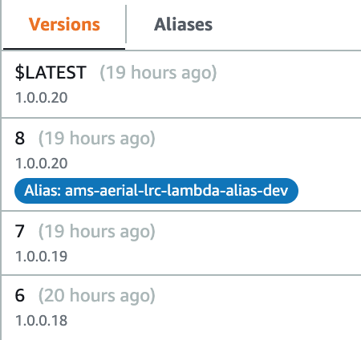

# How to Set Up a Lambda

Lambdas require some additional set up.

## Creating the Lambda in AWS

When you create a lambda that will be deployed with uDeploy you need to add versioning and create an alias for each environment.  The alias must point to a specific version.  If you point to $LATEST uDeploy will not work.  Additionally, you must use the lambda description field to hold your semantic version number.  

### Terraform 

To create an alias that points to a specifc version:
```
resource "aws_lambda_alias" "function_alias" {
  name             = "${var.app}-alias-${var.environment}"
  description      = "alias for udeploy"
  function_name    = aws_lambda_function.function.arn
  function_version = "1"
}
```

Be sure that whatever is invoking your lambda is pointing to the alias and not the function.  For example:
```
resource "aws_lambda_event_source_mapping" "lambda_event" {
  batch_size       = 1
  enabled          = true
  event_source_arn = aws_sqs_queue.queue.arn
  function_name    = aws_lambda_alias.function_alias.arn
}
```

### AWS Console 

In this screenshot you can see that the lambda description is set to **1.0.0.20**.  This is the version that will be parsed by the regex in uDeploy.  You can put anything you want here as you are responsible for creating the regex.


In this screenshot you can see the alias **ams-aerial-lrc-lambda-dev-alias** is currently pointing to version 8.  In your CI/CD process, each time a new version of the lambda is published you must point your alias to the new version.  Pointing the alias to $LATEST will not work.  When you deploy your lambda to another environment via uDeploy it will handle repointing your alias.



## CI/CD

Your CI/CD process will need to do the following:
1. Update the lambda description to your semantic version (ex `aws lambda update-function-configuration --function-name $FUNCTION --description $DESCRIPTION`).
1. Publish a new version (ex `aws lambda update-function-code --function-name $FUNCTION --publish --zip-file $FILE`).
1. Point your alias to the newly published version (ex `aws lambda update-alias --function-name $FUNCTION --function-version $VERSION --name $ALIAS`).

To perform these functions, your CI/CD AWS account will need to have these permissions:
* lambda:UpdateFunctionCode
* lambda:UpdateFunctionConfiguration
* lambda:UpdateAlias

## uDeploy

Once you have the alias and versioning set up for your lambda you can add the lambda to uDeploy.


The key things to note here are your function name, your alias name, and a regular expression that will parse your lambda description.

If everything is set up correctly, your dashboard will look like this:


Notice the cards are blue.  uDeploy is not aware of when the lambda is actually executing.  Also note the revision number corresponds to your version number.

Don't forget to give yourself permissions to deploy.